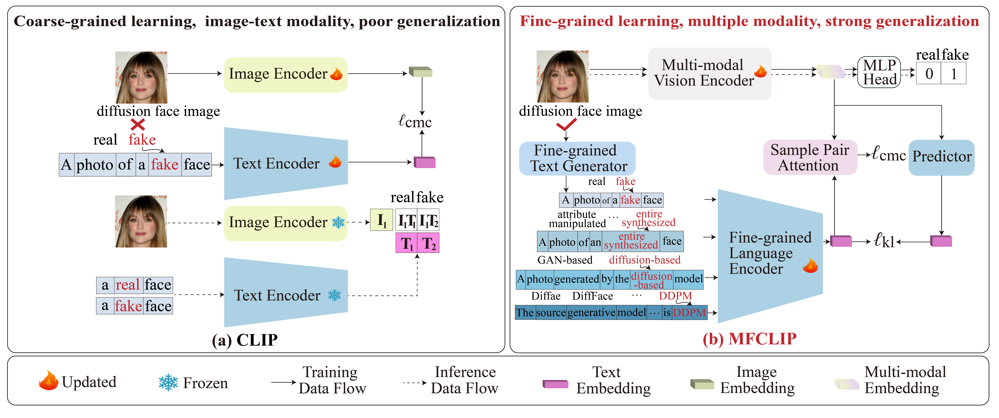

# MFCLIP: Multi-modal Fine-grained CLIP for Generalizable Diffusion Face Forgery Detection
</div>
<div align="center">
  <a href="https://arxiv.org/abs/2409.09724">
    MFCLIP: Multi-modal Fine-grained CLIP for Generalizable Diffusion Face Forgery Detection
  </a>
</div>

## Abstract
The rapid development of photo-realistic face generation methods has raised significant concerns in society and academia, highlighting the urgent need for robust and generalizable face forgery detection (FFD) techniques. Although existing approaches mainly capture face forgery patterns using image modality, other modalities like fine-grained noises and texts are not fully explored, which limits the generalization capability of the model. In addition, most FFD methods tend to identify facial images generated by GAN, but struggle to detect unseen diffusion-synthesized ones. To address the limitations, we aim to leverage the cutting-edge foundation model, contrastive language-image pre-training (CLIP), to achieve generalizable diffusion face forgery detection (DFFD). In this paper, we propose a novel multi-modal fine-grained CLIP (MFCLIP) model, which mines comprehensive and fine-grained forgery traces across image-noise modalities via language-guided face forgery representation learning, to facilitate the advancement of DFFD. Specifically, we devise a fine-grained language encoder (FLE) that extracts fine global language features from hierarchical text prompts. We design a multi-modal vision encoder (MVE) to capture global image forgery embeddings as well as fine-grained noise forgery patterns extracted from the richest patch, and integrate them to mine general visual forgery traces. Moreover, we build an innovative plug-and-play sample pair attention (SPA) method to emphasize relevant negative pairs and suppress irrelevant ones, allowing cross-modality sample pairs to conduct more flexible alignment. Extensive experiments and visualizations show that our model outperforms the state of the arts on different settings like cross-generator, cross-forgery, and cross-dataset evaluations.

## Overview



## News
* **2025-04:** Codes of the MFCLIP model are released.


## Environmental requirements

- Python version：3.10.16  CUDA version: 11.7
- Dependent libraries：
  - torch=2.0.1+cu117
  - scikit-image=0.25.2
  - scikit-learn=1.6.1
  - scipy=1.15.2
  - tokenizers=0.13.3
  - torchvision=0.15.2+cu117
  - transformers=4.30.0
  - numpy=1.23.5
  - peft=0.4.0

## Install packages
```bash
git clone https://github.com/Jenine-321/MFCLIP.git
cd MFCLIP
conda create -n MFCLIP python=3.10.16
conda activate MFCLIP

conda install pytorch==2.0.1 torchvision==0.15.2 -c pytorch 

pip install -r requirements.txt
```


## Directories structure

```
MFCLIP
├── checkpoints
├── data
├── models
 └── MFCLIP_Load.py
 └── MFCLIP.py
 └── MVE.py
 └── ...
├──  train.py
├──  test.py
├──  requirements.txt
```


## Train


## Evaluate

## Citation
If you find this work useful for your research, please consider citing the following:
```bibtex
@ARTICLE{MFCLIP,
  author={Zhang, Yaning and Wang, Tianyi and Yu, Zitong and Gao, Zan and Shen, Linlin and Chen, Shengyong},
  journal={IEEE Transactions on Information Forensics and Security}, 
  title={MFCLIP: Multi-Modal Fine-Grained CLIP for Generalizable Diffusion Face Forgery Detection}, 
  year={2025},
  volume={20},
  number={},
  pages={5888-5903},
  doi={10.1109/TIFS.2025.3576577}}

```
